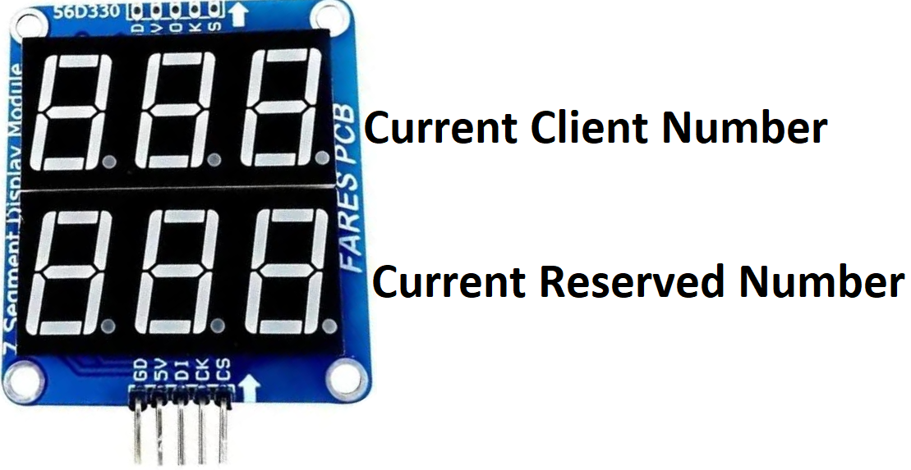
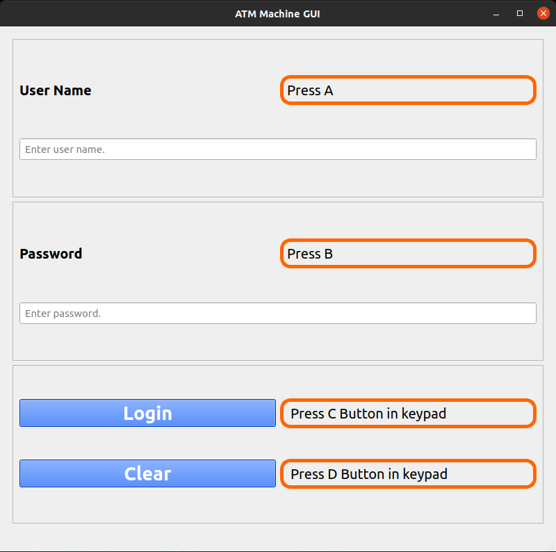
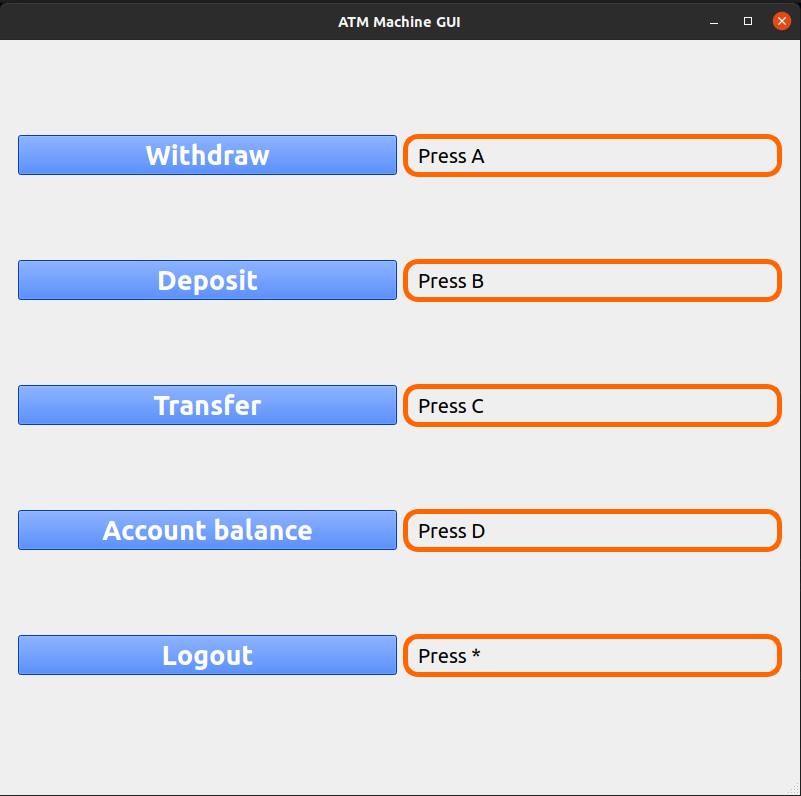
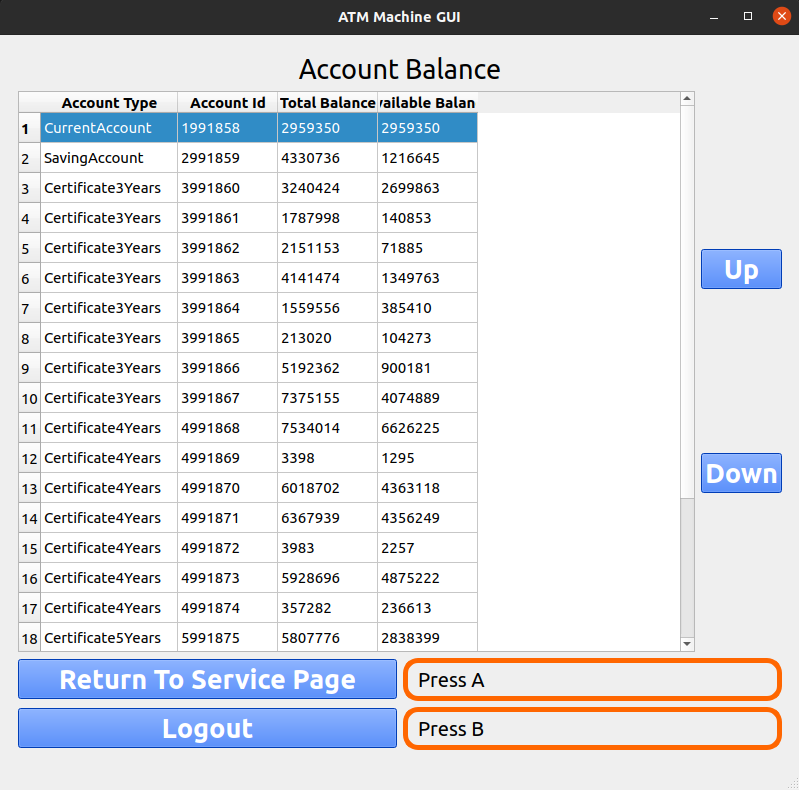
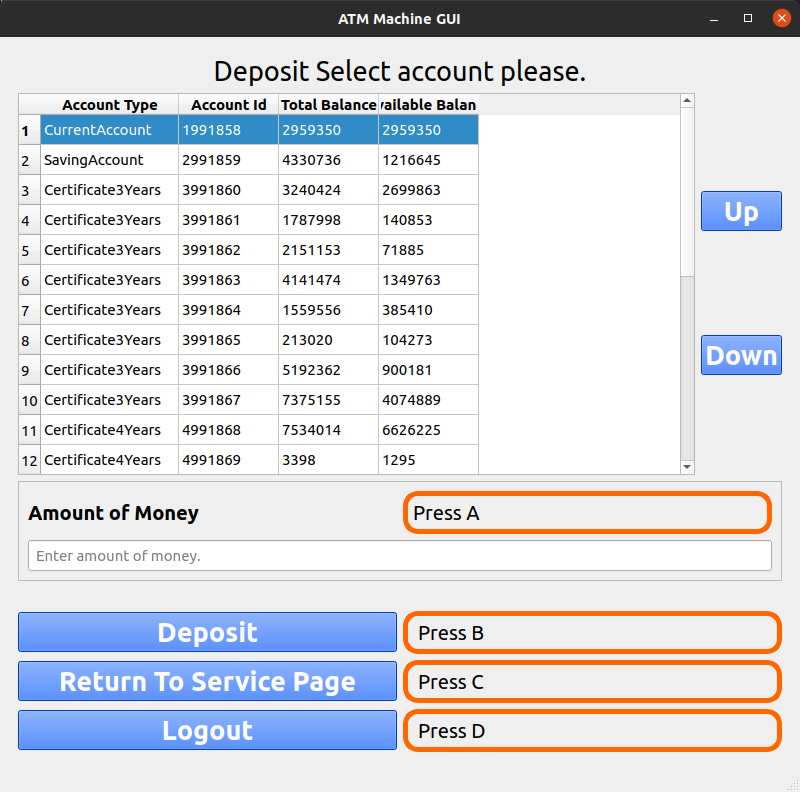
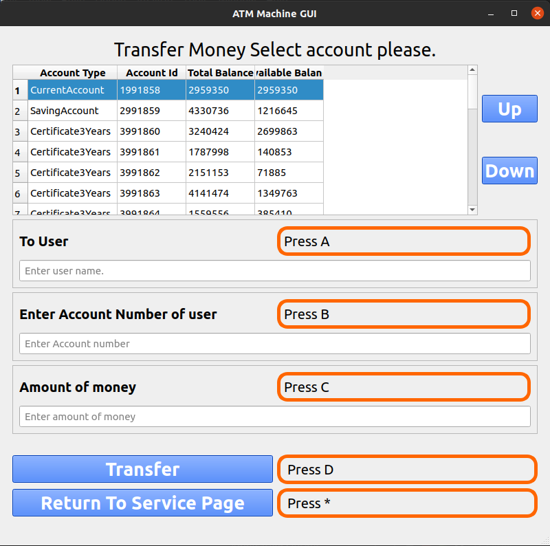

# ATM Application
Developed an ATM machine application for Raspberry Pi, integrated with a Yocto-based image. The project includes a dedicated Yocto layer [Click here to view this yocto-layer ](https://github.com/AhmedAbd-ElFattah/meta-atm-machine)  which is responsible for compiling the ATM application and additional Linux device drivers.


## Table of Contents

- [Project Operation](#project-operation)
    - [Queue Management System](#queue-management-system)
    - [LED Indicators for System Availability](#led-indicators-for-system-availability)
    - [Keypad for Data Entry](#keypad-for-data-entry)
    - [Buzzer for Interactive Feedback](#buzzer-for-interactive-feedback)
    - [Scrolling device](#scrolling-device)

- [Application Pages](#application-pages)
    - [Login Page](#login-page)
    - [Service Page](#service-page)
    - [Account Balance Page](#account-balance-page)
    - [Deposit Page](#deposit-page)
    - [Transfer Money Page](#transfer-money-page)

- [Getting started](#getting-started)

## Project Operation
### [Queue Management System](#table-of-contents)
System allows new clients to reserve a number by simply pressing a dedicated push button. When the current client completes his transactions and logs out, the system increments the client number by one.

Seven Segment Module plays a role in keeping users informed. It displays the current client number, providing a clear visual cue for the user currently being served. Additionally, if user pressed push button to reserve a new number it shows his number.



### [LED Indicators for System Availability](#table-of-contents)
Green LED indicator serve as a mechanism to indicate the system's availability. It signifies that the ATM is not busy, indicating to users that they can log in to their accounts.

### [Keypad for Data Entry](#table-of-contents)
Users can input their authentication details and interact with machine through it.


### [Buzzer for Interactive Feedback](#table-of-contents)
Buzzer is integrated to provide audible feedback. It signals successful data input and acknowledges button presses, offering users a confirmation of their actions

### [Scrolling device](#table-of-contents)
Composed of two push buttons one for scrolling up and the other for scrolling down. It integrates with operations like Show Balance, Transfer Balance, Withdraw, and Deposit to navigate between different accounts.


## Application Pages
### [Login Page](#table-of-contents)


### [Service Page](#table-of-contents)


### [Account Balance Page](#table-of-contents)


### [Deposit Page](#table-of-contents)


### [Transfer Money Page](#table-of-contents)


## Getting started
1. Install Build Host Packages of yocto dunfell [Reference.](https://docs.yoctoproject.org/3.1.28/brief-yoctoprojectqs/brief-yoctoprojectqs.html#build-host-packages)

```
sudo apt-get install gawk wget git-core diffstat unzip texinfo gcc-multilib build-essential chrpath socat cpio python3 python3-pip python3-pexpect xz-utils debianutils iputils-ping python3-git python3-jinja2 libegl1-mesa libsdl1.2-dev pylint3 xterm python3-subunit mesa-common-dev
```

2. Select machine through
```bash
export MACHINE="raspberrypi3"
```

3. Clone yocto project dunfell branch
```bash
git clone -b dunfell git://git.yoctoproject.org/poky
cd poky
```

4.  Download the following layers
Note that one of resposibilities of meta-atm-machine layer is fetch application through git repository
```bash
git clone https://github.com/AhmedAbd-ElFattah/meta-atm-machine
git clone -b dunfell https://github.com/meta-qt5/meta-qt5
git clone -b dunfell git://git.openembedded.org/meta-openembedded
git clone -b dunfell git://git.yoctoproject.org/meta-raspberrypi
git clone -b dunfell https://github.com/schnitzeltony/meta-qt5-extra
```

5. run the oe-init-build-env environment setup script
```bash
source oe-init-build-env ATM-Image
```

6. Add theese layers

```bash
bitbake-layers add-layer ../meta-openembedded/meta-oe
bitbake-layers add-layer ../meta-openembedded/meta-python
bitbake-layers add-layer ../meta-openembedded/meta-networking
bitbake-layers add-layer ../meta-openembedded/meta-multimedia
bitbake-layers add-layer ../meta-openembedded/meta-gnome
bitbake-layers add-layer ../meta-raspberrypi
bitbake-layers add-layer ../meta-qt5
bitbake-layers add-layer ../meta-qt5-extra
bitbake-layers add-layer ../meta-atm-machine
```
7. Build Image
```bash
bitbake atm-machine-image
```

8. Flash image into SD-Card
You can use [this link](https://docs.yoctoproject.org/dev/dev-manual/bmaptool.html) from yocto to help you flashing image into SD-Card